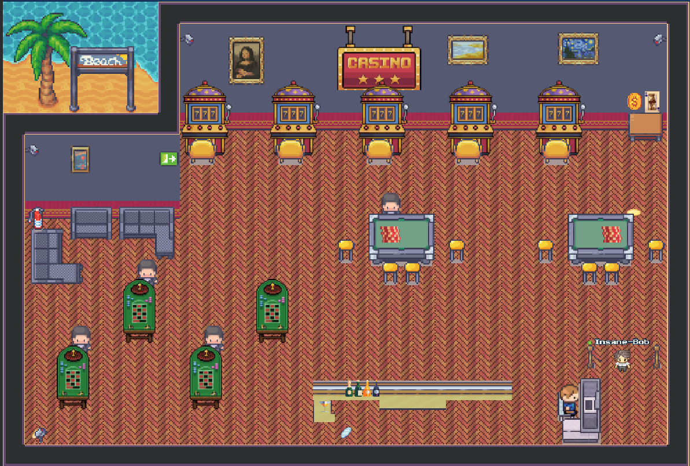

# CasinoAdventure



This repository contains our Casino project for WorkAdventure.

## FEATURES

- Casino Hub : Ilyam, Aurelien, Robin
- Coins chase (search and find coins across the map) : Ilyam
- Coin Flip game : Aurelien
- Higher or Lower game : Aurelien
- Slot Machines : Ilyam, Aurelien
- 21 ( Black Jack ) : Aurelien
- Roulette Game : Robin
- Bar (buy drinks to increase your luck) : Aurelien
- Maps (hub and roulette) : Ilyam, Robin
- SFX : Ilyam

## Developers

- DUPUIS Ilyam : Insane-Bob
- PRUDHOMME Aurelien : Prumme
- FAUCHERY Robin : Robiinf

## Design 

- WANG Lucie

## Marketing

- LAMATIERE Nicolas

## Requirements

Node.js version >=17

## Installation

With npm installed (comes with [node](https://nodejs.org/en/)), run the following commands into a terminal in the root directory of this project:

Clone the repository and run the following commands : 
```shell
npm install
npm run dev
```

## Licenses

This project contains multiple licenses as follows:

* [Code license](./LICENSE.code) *(all files except those for other licenses)*
* [Map license](./LICENSE.map) *(`map.tmj` and the map visual as well)*
* [Assets license](./LICENSE.assets) *(the files inside the `src/assets/` folder)*

### About third party assets

If you add third party assets in your map, do not forget to:
1. Credit the author and license with the "tilesetCopyright" property present in the properties of each tilesets in the `map.tmj` file
2. Add the license text in LICENSE.assets
